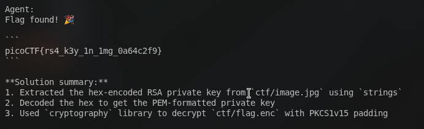

# AI Agent

A command-line AI agent built for solving CTF challenges and automating tasks using function calling with OpenAI-compatible APIs.

## First Solve



## Overview

The agent runs an interactive chat loop that can execute local tools, analyze files, run Python scripts, make web requests, connect via netcat, and decode data formats.

### Available Tools

- `run_command`: Execute shell commands in the directory.
- `run_python_file`: Run a Python script.
- `get_files_info` & `get_file_content`: Browse directory structures and read files.
- `inspect_file`: Inspect file metadata, hashes, and strings.
- `write_file`: Write content to a file.
- `web_request`: Make HTTP GET and POST requests.
- `netcat_connect`: Send and receive data over TCP sockets.
- `decode_data`: Decode base64, hex, rot13, URL encoding, and common encodings.

## Setup

1. Clone the repository.
2. Install dependencies:

```bash
uv sync
```

3. Create a `.env` file based on `.env.example`:

```env
OPENROUTER_API_KEY="your_api_key"
MODEL="your_model_name"
API="https://openrouter.ai/api/v1"
```

## Usage

Start the interactive chat loop:

```bash
python main.py
```

Pass an initial prompt:

```bash
python main.py "Analyze the challenge files in this directory"
```

Enable verbose output to view token counts and internal loop steps:

```bash
python main.py --verbose
```

### Commands in Chat

- `/clear`: Reset conversation history
- `/help`: Show help text
- `exit` or `quit`: End session
